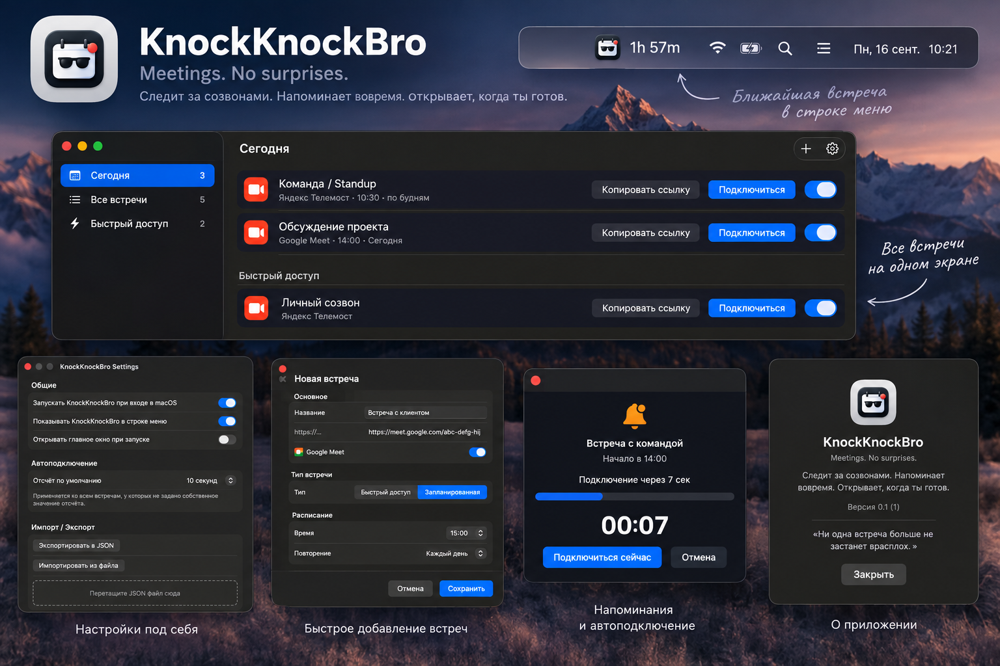

# KnockKnockBro

**Meetings. No surprises.**

KnockKnockBro is a small, native macOS menu bar assistant that keeps track of your online meeting links, shows what's coming up, reminds you in time, and — if you let it — joins the call for you.

It's not tied to any single video service. Yandex Telemost is the primary scenario, but any correctly formed meeting URL works, and the service-detection layer is built to be extended.



🇷🇺 [Читать на русском](README.ru.md)

---

## Features

- **Quick Rooms** — a permanent link for ad-hoc calls, always one click away.
- **Scheduled Meetings** — recurring meetings: daily, weekdays, weekly, or a custom set of weekdays.
- **Automatic service detection** — Yandex Telemost, Google Meet, Zoom, Microsoft Teams, and a graceful fallback for anything else.
- **Multiple independent reminders** per meeting, each with its own offset and sound.
- **Join / Snooze right from the notification** — no need to switch to the app.
- **Skip Today** — cancel a single occurrence of a recurring meeting without touching the recurring schedule itself.
- **Enable / Disable** — pause a meeting entirely; notifications and Auto Join stop, the meeting stays configured.
- **Auto Join** — a visible, cancellable countdown panel before the app opens the meeting URL automatically. Never opens anything without warning.
- **Sleep/Wake aware** — if your Mac was asleep when a meeting started, KnockKnockBro won't silently launch it after the fact; it asks first.
- **Menu bar first** — live countdown to the next meeting right in the menu bar, with a quick popover for today's schedule and Quick Rooms.
- **Sidebar main window** — Today / All Meetings / Quick Access, all backed by the same underlying data.
- **JSON export & import** — a single human-readable file, versioned, with drag & drop support and full validation before anything is applied.
- **Login at startup** — via the modern `SMAppService` API, no legacy login-item hacks.
- **100% local** — no account, no backend, no telemetry. Everything lives in a JSON file in your own `Application Support` folder.

## Requirements

- macOS 14 (Sonoma) or later
- Xcode 16 or later (to build from source)

## Building from source

```bash
git clone https://github.com/<your-username>/KnockKnockBro.git
cd KnockKnockBro
open KnockKnockBro.xcodeproj
```

Build and run with `Cmd+R`. No third-party dependencies, no package manager setup required — it's a plain SwiftUI app.

> KnockKnockBro isn't notarized with an Apple Developer ID. If you download a pre-built `.app` rather than building it yourself, macOS Gatekeeper will initially block it — go to **System Settings → Privacy & Security → Security** and click **Open Anyway**.

## Architecture

The project is organized by responsibility rather than by screen:

```
KnockKnockBro/
├── Models/       — Meeting, MeetingSchedule, MeetingReminder, AutoJoinSettings, exceptions
├── Services/     — MeetingStore, OccurrenceEngine, NotificationService, AutoJoinService,
│                   MeetingLauncher, MeetingProviderDetector, ImportExportService, and more
├── MenuBar…       — menu bar label and popover content
├── Views/        — main window, meeting editor, settings, About, Auto Join countdown panel
└── KnockKnockBroApp.swift
```

A few decisions worth knowing about if you're reading the code:

- **Recurrence vs. exceptions are separate.** A `Meeting`'s schedule describes the *rule* (e.g. "every day at 10:00"). Per-day overrides — Skip Today, Auto Join cancelled for today — live in a separate `MeetingOccurrenceException` list, so a single skipped day never touches the recurring rule itself.
- **Occurrences are computed, not stored.** `OccurrenceEngine` expands a recurrence rule into concrete calendar instances on demand, for a given date range. This keeps the data model small and makes the expansion logic independently testable (including DST transitions, month boundaries, etc.).
- **Notifications are scheduled as discrete one-shot requests**, not a single repeating trigger — `UNCalendarNotificationTrigger` with `repeats: true` can't have a single occurrence cancelled without cancelling the whole series, which Skip Today needs to do.
- **Auto Join runs in its own floating `NSPanel`**, independent of the main window, so the countdown is always visible regardless of whether the main window is open.

## Roadmap (not in this release)

- Configurable reminder sound volume
- A fully independent panel for the "missed while asleep" prompt (currently a window sheet)
- Direct native-app launch for services with a documented URL scheme (confirmed feasible for Zoom; Microsoft Teams is possible but historically flaky; Yandex Telemost's app registers a `telemost://` scheme but its exact URL format isn't publicly documented yet)

## License

MIT — see [LICENSE](LICENSE).
