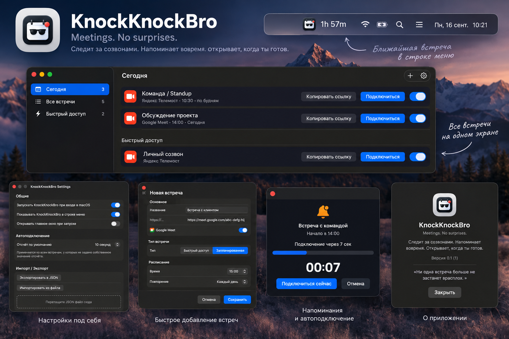

# KnockKnockBro

**Meetings. No surprises.**

[](https://github.com/le0hard/KnockKnockBro/releases/latest)


[](LICENSE)

KnockKnockBro is a small native macOS menu bar assistant for online meetings. It keeps your meeting links in one place, shows what's coming up, knocks when it's time — and, if you let it, joins the call for you after a visible countdown.

It isn't tied to one video service. Yandex Telemost is the primary scenario (including its desktop app), but Google Meet, Zoom, Microsoft Teams and any other meeting URL work too.



🇷🇺 [Читать на русском](README.ru.md)

---

## Download

Grab the latest `KnockKnockBro-vX.Y.Z.zip` from [**Releases**](https://github.com/le0hard/KnockKnockBro/releases/latest), unzip it and move **KnockKnockBro.app** to Applications.

> The app isn't notarized with an Apple Developer ID, so macOS blocks it on first launch. Open **System Settings → Privacy & Security** and click **Open Anyway** — you only need to do this once per version.

KnockKnockBro checks for new versions itself (see [Updates](#updates)).

## Features

### Menu bar first
- Countdown to today's next meeting right in the menu bar (`12m`) — and just the icon when there's nothing left today.
- A popover with the next meeting, today's schedule and Quick Rooms: large aligned `HH:MM` times with "in 12 min" underneath, a gently blinking clock colon, compact Join / copy buttons, **Skip** for the next meeting, native-style hover highlight.
- One click to the Calendar, the main window or Settings.

### Meetings
- **Quick Rooms** — permanent links for ad-hoc calls.
- **Recurring meetings** — daily, weekdays, weekly or any set of weekdays.
- **One-time meetings** — on a specific date, optionally deleted automatically an hour after the start; past ones move to the **Archive**.
- **Automatic service detection** by link: Yandex Telemost, Google Meet, Zoom, Microsoft Teams — any other URL is stored and opened as is.
- **Yandex Telemost desktop app** — join in the app, in the browser, or choose each time.
- **Enable / Disable** a meeting without deleting it; **Skip Today** cancels a single occurrence without touching the schedule.

### Reminders and joining
- Any number of reminders per meeting, each with its own time and sound.
- **Join** and **In 5 minutes** right from the notification.
- **Auto Join** — a floating countdown panel (5–60 s or your own value) before the link opens: **Join now**, **I'm already in the meeting** or **Cancel** for today only. KnockKnockBro never opens a meeting without warning.
- **Knows you already joined** — a Join click from 15 minutes before the start (configurable) until the end of the day marks the meeting as joined: no more Auto Join, reminders or prompts that day, and a green checkmark everywhere.
- **Sleep / Wake aware** — if the Mac was asleep when a meeting started, you get "Daily started 3 minutes ago — Join / Skip" instead of a surprise.
- Past meetings are struck through, so the day's progress is visible at a glance.

### Calendar and main window
- **Calendar** — a month grid with meeting days marked and the agenda of the selected day.
- **Main window** — Today / All Meetings / Quick Access / Archive, with Copy (name, time and link) and the standard macOS **Share** menu.

### Your data
- **Export & import** in one human-readable, versioned JSON file — meetings *and* app settings. Choose exactly which meetings (and whether settings) to export or import, **merge** or **replace**, drag & drop a file onto the window. Every file is fully validated first; an invalid file never changes your data.
- **100% local** — no account, no server, no telemetry.

### Updates
At most once a day, and only when you open Settings (never at launch), KnockKnockBro asks GitHub Releases whether a newer version exists and offers to open the download page. You can also press **Check for Updates** in Settings or the About window. Nothing is downloaded or installed automatically.

## Privacy

- Meetings are stored in `~/Library/Containers/…/Application Support/KnockKnockBro/meetings.json`, settings in the app's standard preferences.
- The only network request KnockKnockBro makes itself is the update check to `api.github.com`. Meeting links are opened by macOS in your browser or the service's app.

## Requirements

- macOS 14 (Sonoma) or later
- Xcode 16 or later to build from source

## Building from source

```bash
git clone https://github.com/le0hard/KnockKnockBro.git
cd KnockKnockBro
open KnockKnockBro.xcodeproj
```

Build and run with `⌘R`, run the tests with `⌘U`. No third-party dependencies — a plain SwiftUI app.

## Architecture

Organized by responsibility rather than by screen:

```
KnockKnockBro/
├── KnockKnockBroApp.swift, AppDelegate.swift   — scenes, app lifecycle
├── MenuBarContentView.swift, MenuBarLabelView.swift — menu bar popover and label
├── Models/     — Meeting, MeetingSchedule, CalendarDay, MeetingReminder, AutoJoinSettings,
│                 MeetingOccurrenceException, AppSettingsSnapshot, …
├── Services/   — MeetingStore, OccurrenceEngine, NotificationService, AutoJoinService/Runtime,
│                 WakeObserver, JoinTracking, MeetingLauncher, MeetingProviderDetector,
│                 ImportExportService, UpdateChecker, LoginItemService, …
└── Views/      — Meetings, MeetingEditor, Calendar, Import, Settings, About,
                  AutoJoinCountdown, Components
KnockKnockBroTests/ — unit tests for the scheduling, import/export and join logic
```

A few decisions worth knowing when reading the code:

- **Rules and exceptions are separate.** A schedule describes the *rule* ("weekdays at 10:00" or "once on 5 October"). Per-day marks — skipped, Auto Join cancelled, joined — live in `MeetingOccurrenceException`, so one day never changes the rule.
- **Occurrences are computed, not stored.** `OccurrenceEngine` expands rules into concrete dates on demand; the menu bar, notifications, Auto Join and the calendar all use it, and it is tested across DST changes and month boundaries.
- **Notifications are one-shot requests** planned 48 hours ahead, so a single day can be skipped without cancelling a whole repeating series.
- **Auto Join lives in its own floating `NSPanel`**, independent of the main window.
- **Import is validate-then-apply.** `ImportExportService.validate` is a pure function; nothing is written until the user confirms, and merging is plain, tested logic.
- **Versioned file format** (currently 3). Newer versions read all older files; older versions reject newer files with a clear message instead of guessing.

See [CHANGELOG.md](CHANGELOG.md) for the full history and backlog.

## Roadmap

- Meetings from the macOS Calendar (EventKit) — import or live connection
- Automatic updates (Sparkle) and an update feed on a custom domain
- A standalone window for the "started while your Mac was asleep" prompt
- Reminder sound volume
- Opening Zoom / Teams meetings directly in their apps

## License

MIT — see [LICENSE](LICENSE).
